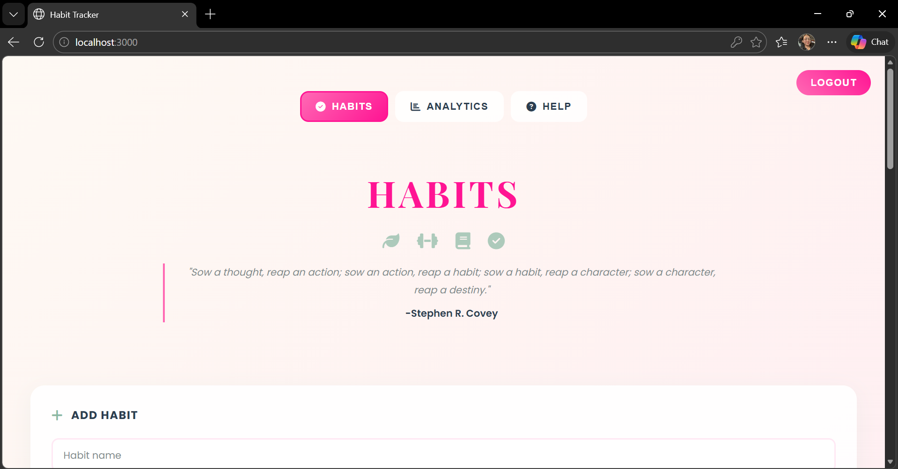
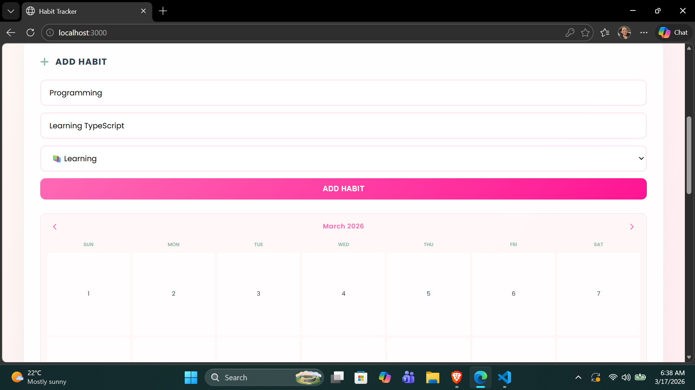
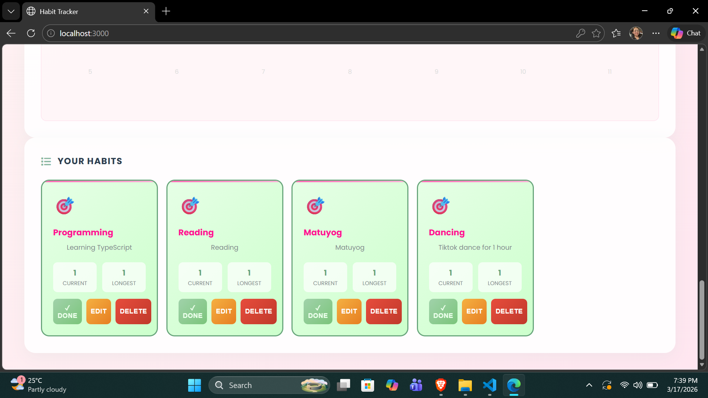
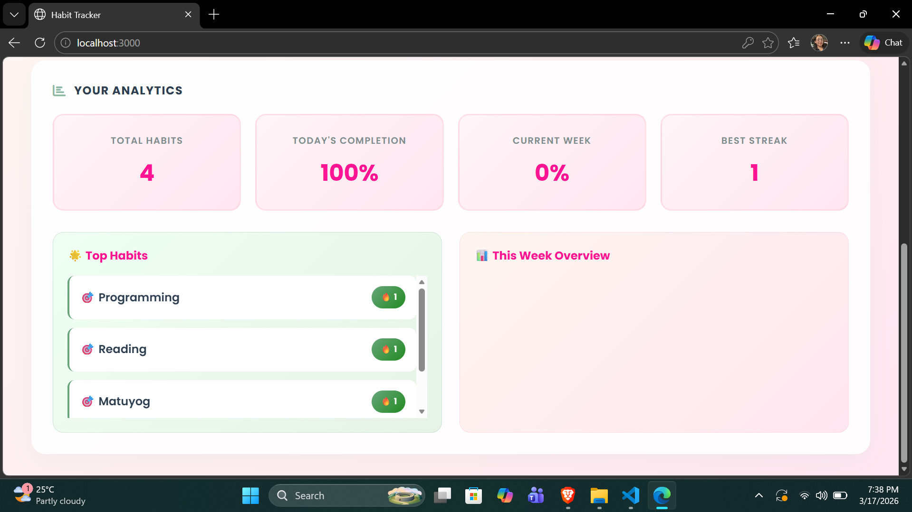
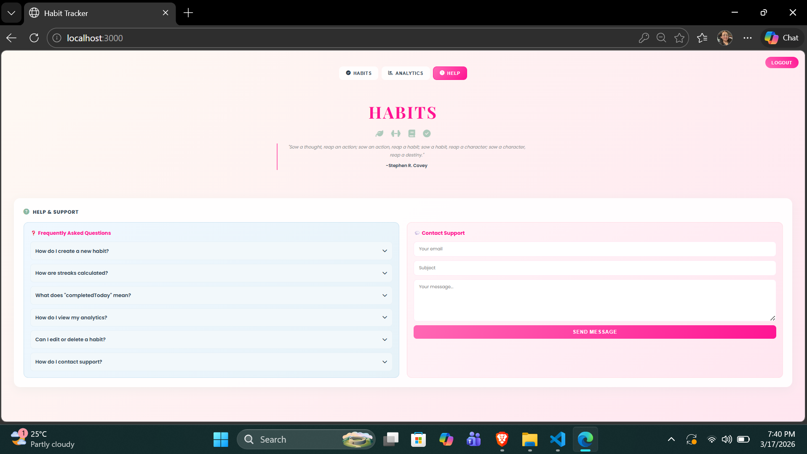

# Habit Tracker - Assignment Summary

## Features Added

### 1) Habit Analytics Dashboard
- Mini spec: Provide dashboard metrics for habit progress (total habits, daily/weekly completion %, best streak, top 3 habits, 7-day completion chart).
- Implemented: Analytics tab with stat cards, top habit list, weekly chart; client-side calculations from `/api/habits`.

### 2) Help & FAQ Center
- Mini spec: Provide FAQ section with expandable Q&A and a contact support form (email, subject, message).
- Implemented: Help tab with 6 FAQ items, accordion toggles, and a contact form with validation and confirmation.

## What Was Implemented
- Added dashboard tab navigation (Habits  "/ Analytics / Help).
- Built Analytics dashboard UI + data calculations using habit API data.
- Built Help/FAQ UI with toggle-able answers and contact form.
- Kept consistent design theme (pink/sage glassmorphism) and responsive layout.

## Screenshots

### Home Page

### Add Habit

### Added Habit

### Analytics

### FAQ

## Challenges Encountered
- Ensuring the analytics calculations reflected the correct date ranges (today + last 7 days) required careful date formatting.
- Keeping the calendar widget compact and visually clean while retaining usability took iterative styling adjustments.

