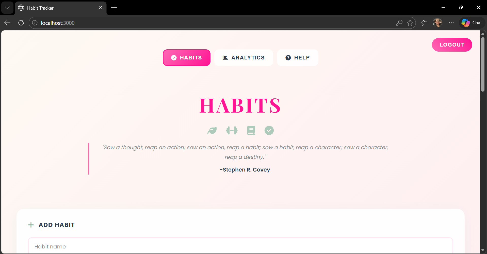
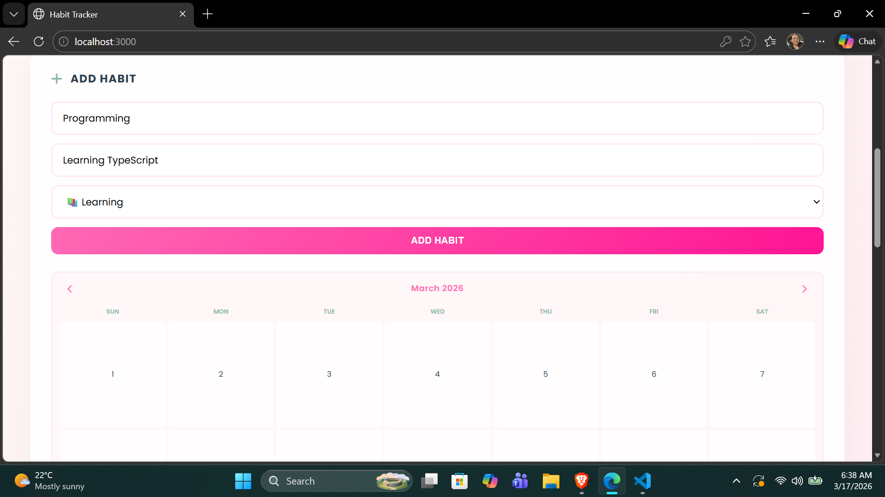
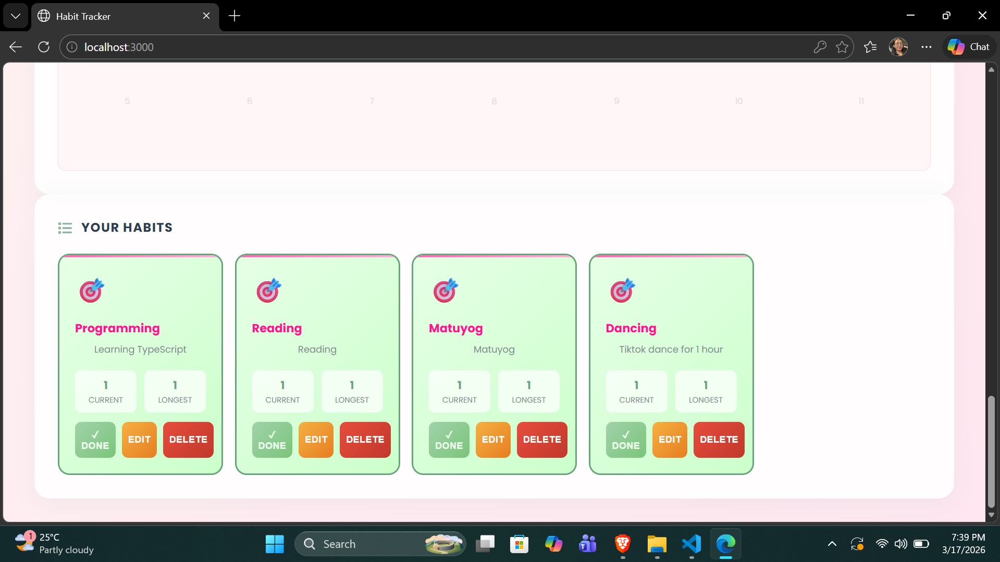
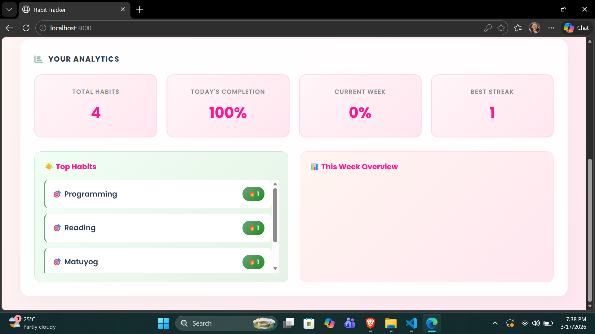
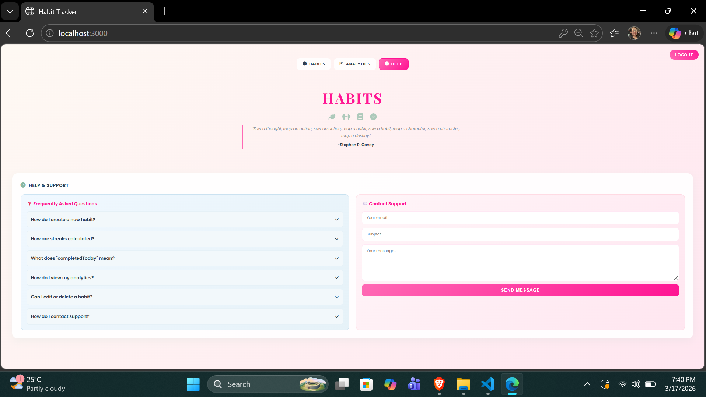

<p align="center">
  <a href="http://nestjs.com/" target="blank"></a>
</p>
  
<p align="center">A progressive <a href="http://nodejs.org" target="_blank">Node.js</a> framework for building efficient and scalable server-side applications.</p>

# Habit Tracker

## Student Information
Shery Jade R. Garcia


## Features Added
- Mini spec: Provide dashboard metrics for habit progress (total habits, daily/weekly completion %, best streak, top 3 habits, 7-day completion chart).
- Implemented: Analytics tab with stat cards, top habit list, weekly chart; client-side calculations from `/api/habits`.
- Mini spec: Provide FAQ section with expandable Q&A and a contact support form (email, subject, message).

---
- Implemented: Help tab with 6 FAQ items, accordion toggles, and a contact form with validation and confirmation.

## What Was Implemented
- Added dashboard tab navigation (Habits  "/ Analytics / Help).
- Built Analytics dashboard UI + data calculations using habit API data.
- Built Help/FAQ UI with toggle-able answers and contact form.
- Kept consistent design theme (pink/sage glassmorphism) and responsive layout.

## Screenshots

### Home Page


### Add Habit


### Added Habit


### Analytics


### FAQ



## Project Setup & Running Instructions

### Prerequisites
- [Node.js](https://nodejs.org/) (v16 or higher recommended)
- [npm](https://www.npmjs.com/) (comes with Node.js)
- [WAMP](https://www.wampserver.com/en/) or [XAMPP](https://www.apachefriends.org/) (for MySQL server)

### 1. Clone the Repository
```
git clone <repository-url>
cd habit-tracker
```

### 2. Set Up the MySQL Database
1. Start your WAMP/XAMPP server.
2. Open phpMyAdmin (usually at http://localhost/phpmyadmin).
3. Create a new database named: `habit_tracker`
4. (Optional) Import any provided SQL file if available, or let the backend auto-create tables on first run.

### 3. Configure Database Connection
- Edit the backend configuration (usually in `src/app.module.ts` or a `.env` file) to match your MySQL credentials:
  - **Host:** `localhost`
  - **Port:** `3306`
  - **User:** `root` (or your MySQL username)
  - **Password:** (your MySQL password)
  - **Database:** `habit_tracker`

> **Note:** If you need help with the config, please check the code or ask for the exact file/line.

### 4. Install Dependencies (Backend)
```
npm install
```

### 5. Run the Backend Server (NestJS API)
```
npm run start
```
The backend will start on [http://localhost:3000](http://localhost:3000) by default.

### 6. Open the Frontend (Static Web UI)
- Open the file `public/index.html` directly in your web browser (double-click or right-click > Open with browser).
- The frontend will connect to the backend API at `http://localhost:3000`.